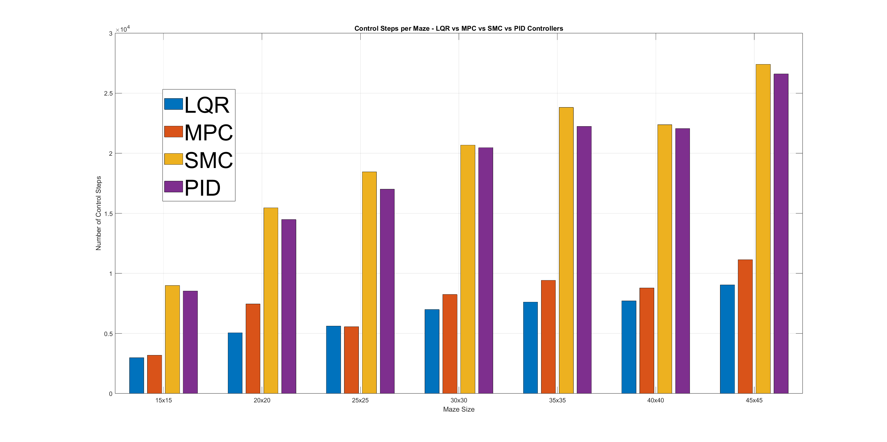
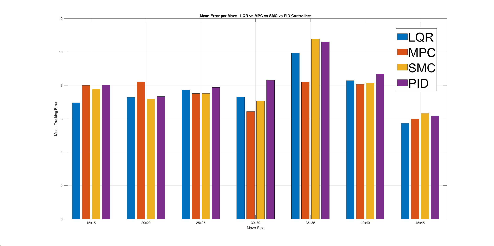
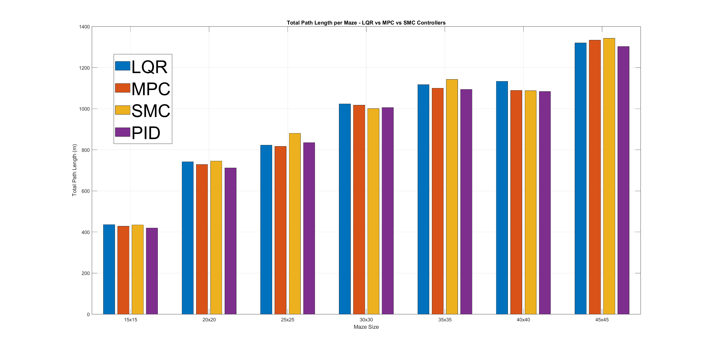
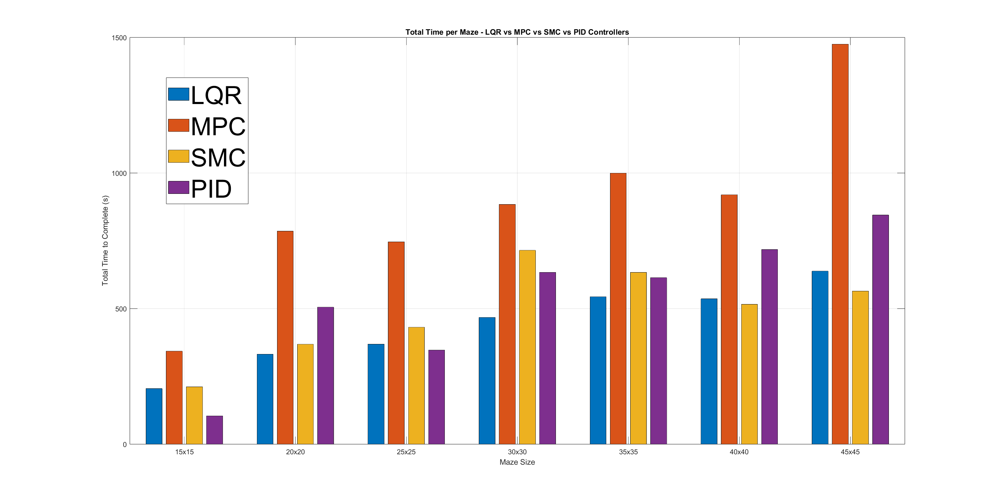

# Maze-Solving Robot using PRM with PID, LQR, MPC, and SMC Controllers

This project implements a differential-drive robot simulation in MATLAB for navigating complex maze environments. The robot uses the Probabilistic Roadmap (PRM) algorithm for path planning and supports four different control strategies for trajectory tracking:

- PID (Proportional-Integral-Derivative)
- LQR (Linear Quadratic Regulator)
- MPC (Model Predictive Control)
- SMC (Sliding Mode Control)

The system is built for comparative performance analysis across a variety of mazes with increasing complexity.

## System Components

### Robot Model

The robot is modeled as a unicycle:
- State: [x, y, θ]
- Inputs: linear velocity (v) and angular velocity (ω)

### Environment

- Eight different maze images are converted to binary occupancy grids.
- Black represents obstacles; white represents free space.
- Maze data is loaded from `mazeLibrary.mat`.

### Path Planning

- The PRM algorithm samples the free space and connects valid nodes to form a roadmap.
- Dijkstra or A* is used to extract a feasible path from the roadmap between start and goal points.

### Controllers

#### PID Controller
- A simple feedback control system using proportional, integral, and derivative gains.
- Requires manual tuning.

#### LQR Controller
- An optimal controller that minimizes a quadratic cost function.
- Requires system linearization at each reference point.

#### MPC Controller
- A predictive controller that solves an optimization problem at each step.
- Incorporates constraints on states and inputs.

#### SMC Controller
- A robust control method that drives the system state along a sliding surface to reach the target.

---

## Performance Analysis

Below are the comparative plots evaluating the performance of all four controllers across different maze sizes using key metrics:

### 1. Number of Control Steps

This plot compares how many discrete control steps each controller takes to solve each maze. Fewer steps generally indicate smoother or more efficient control.

---

### 2. Mean Tracking Error

This graph shows the average deviation from the planned trajectory across the entire path. Lower values indicate better trajectory following.

---

### 3. Total Path Length

Here we observe the total distance traveled by the robot across each maze. Ideally, this should be close to the PRM path length.

---

### 4. Total Time to Completion

This metric captures how long (in seconds) each controller takes to reach the goal from the start. Lower time often correlates with higher average speed and efficient control.

---

## License

This project is open-sourced under the MIT License.
